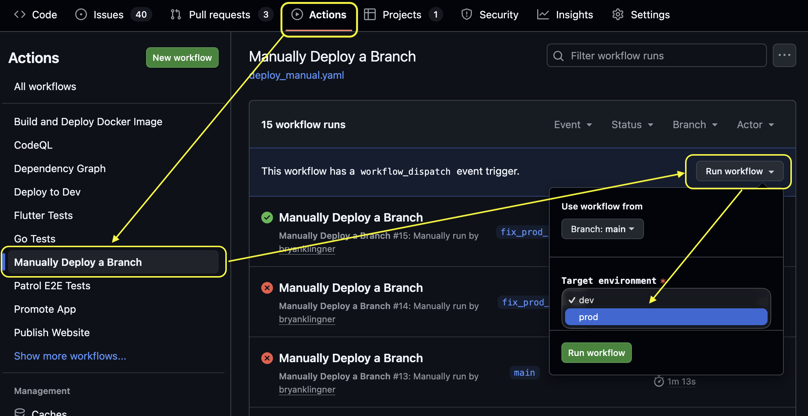
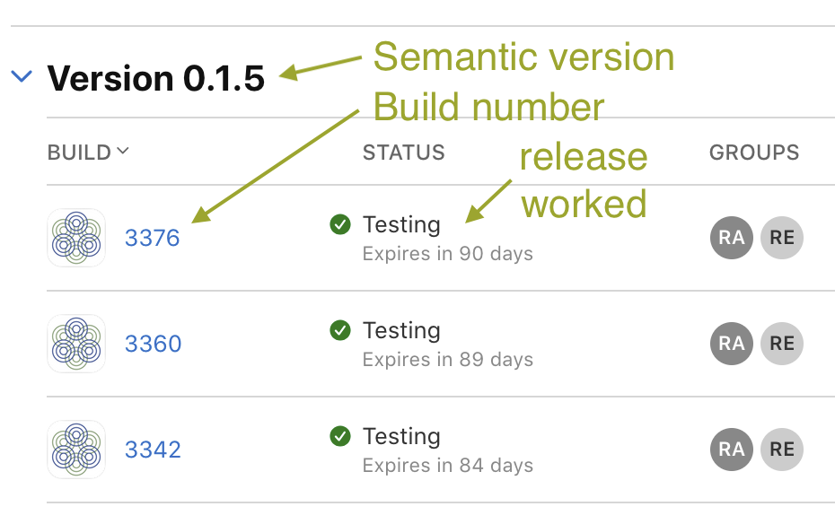
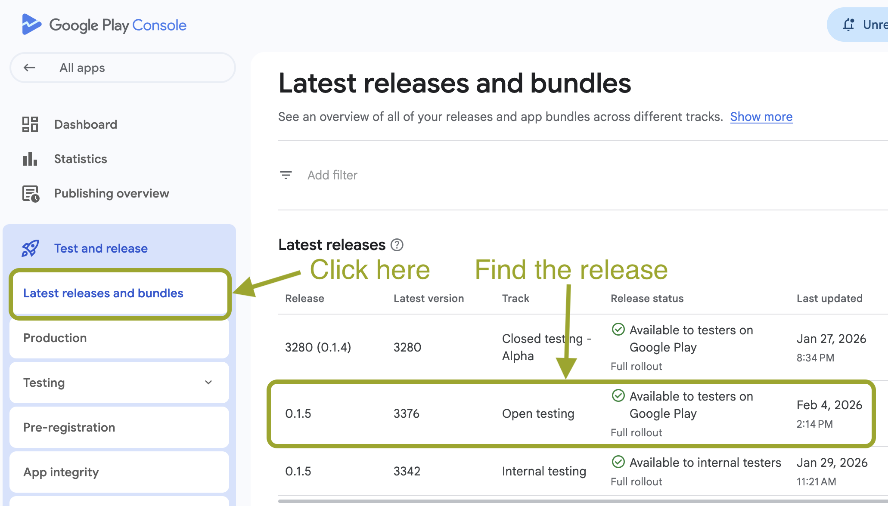

---
# Doc-context metadata for docs/llms.txt — update when this doc changes.
# How it works + schema: docs/context_map.md
context:
  description: Prod release cheat sheet — the Cut Release / Release Finalize workflow path, server/Docker deploy, data-model safety checks, version-number choice, release-notes requirements, and the manual tag-based fallback.
  globs: [.github/workflows/release_cut.yaml, .github/workflows/release_finalize.yaml, app/pubspec.yaml, docs/release/notes/**]
  triggers: [release, cut-release, prod-deploy, version-bump, release-notes, semantic-version]
  lens: [infra]
  skills: [issue, audit, triage]
  domain: release
freshness:
  verified_commit: "ad3b0cdb0"
  verified_on: "2026-06-09"
---
# Prod release cheat sheet

## Primary path: the `Cut Release` workflow

For most releases, trigger the **Cut Release** GitHub Action and pick a
bump size (`fix`, `minor`, `major`). It bumps `app/pubspec.yaml`, generates
release notes, regenerates the website HTML, and opens a PR for review.
Merging the PR fires **Release Finalize**, which deploys the resulting
`main` HEAD to prod and (gated on prod-deploy success) tags the merge
commit, which in turn triggers **Release App** for iOS + Android.

You only review and merge the version-bump PR — everything else is
automated. The sections below describe the manual fallback if you need to
do any step by hand.

## Server binary / Docker package

Whenever we merge a PR into main, it is automatically deployed to the dev environment via a Github Action workflow.

You deploy to prod by triggering the same action but targeting the 'prod' environment.

### Safety check: are there any database / data model changes?

Review changes to `proto/ripls/models`. Are there non-backwards compatible changes to any of the data models? Examples of non-backward compatible changes are:

- renaming a proto (changes column name)
- renumbering proto fields (changes column -> field mapping)

The server will automatically handle adding new fields (columns), as long as you don't renumber the fields.

If we did make non-backwards compatible changes to the data model, you'll need to migrate the database manually or reset the database (see below).

### Safety check: did any new API field land on only one path?

For every field added to a save-style API request, verify the corresponding
read-path response(s) carry it too. A value the client sets but can't read
back is the #1142 class of bug — the client can never echo a value it
can't receive.

See [`docs/proto_conventions.md`](../proto_conventions.md) for the
conventions. Round-trip tests in `server/services/*/roundtrip_test.go`
catch most instances of this automatically; add one for any new API field
with round-trip semantics.

### Optional: Reset the production database

If you need to start fresh with an empty database, delete and recreate the `ripls` database on Cloud SQL. The server will automatically initialize the schema on startup.

```bash
PROD="$(scripts/gcp_project.sh prod)"

# Delete the existing database
gcloud sql databases delete ripls \
  --instance="$PROD" \
  --project="$PROD"

# Recreate the empty database
gcloud sql databases create ripls \
  --instance="$PROD" \
  --project="$PROD"
```

You may encounter errors that you can't delete the database. If you do, you need to go into Google Cloud Console and restart the Cloud SQL instance. Then you should be able to delete it.

### Deploy a new server binary to prod

Here's how to deploy the current main to prod:



## Releasing a new version of the app

### Choose a new version number

The version system includes both a _semantic version_ and a _build number_:

- **Semantic version** (e.g. `1.2.0`): Stored in `pubspec.yaml`, manually bumped for releases
- **Build number** (`3472`): Automatically calculated from git commit count
- **Full version** (`1.2.0+3472`): Assembled at build time

The semantic version is what you need to choose. Look at the current semantic version in `pubspec.yaml` and increment the version according to the following rules:

- **Patch** (1.0.0 → 1.0.1): Bug fixes only
- **Minor** (1.0.0 → 1.1.0): New features, backward compatible
- **Major** (1.0.0 → 2.0.0): Breaking changes

### Create a git branch for the release PR

```bash
git checkout main
git pull origin main
git checkout -b bump-version-1.1.0

# Edit app/pubspec.yaml
# Change: version: 1.0.0
# To:     version: 1.1.0

git add app/pubspec.yaml
git commit -m "Bump version to 1.1.0"
```

### Create release notes

Every release must include release notes saved in `docs/release/notes/X.Y.Z.md`. The release automation will fail if this file is missing.

The release notes are automatically included in:

- **iOS TestFlight**: Displayed in the "What to Test" field for testers
- **Google Play Open Testing**: Displayed as the release notes for beta testers

The detail in the release notes depends on the significance of the release:

- Patch releases include a list of all bugs fixed since the last patch
- Minor releases include a list of all new features, plus above
- Major releases should be a lavish and splendid affair indeed

The canonical prompt for generating release notes lives in
[`notes_prompt.md`](notes_prompt.md). Both the automated `Cut Release`
workflow and the `/ripls-release` skill use it; if you're writing notes
by hand, follow the same prompt so the output is consistent.

Rerun `npm run generate:release-notes` to convert the release notes to HTML in website directory for publication.

Commit the release notes.

### Open a PR and get it reviewed and merged

```bash
git push origin bump-version-1.1.0

# Open a PR and get it reviewed and merged
```

### Trigger the release

**Important:** The release tag must be created on the `main` branch. The workflow will fail if the tagged commit is not on main.

```bash
# Make sure you're on main with latest changes
git checkout main
git pull origin main

# Create annotated tag
git tag -a v1.1.0 -m "Release 1.1.0: Add gear categories feature"

# Push tag to trigger release
git push origin v1.1.0
```

### Double check the release worked

Now make sure the build actually happened:

1. Go to GitHub → Actions → Release App
2. Watch both iOS and Android jobs
3. Check for any failures

#### iOS: Check App Store Connect

You should find a release with the correct version under your app's
**TestFlight → iOS** tab in [App Store Connect](https://appstoreconnect.apple.com/apps).



#### Android: Check Google Play Console

You should find a new "open testing" release under your app's **Releases
overview** in the [Google Play Console](https://play.google.com/console/).


