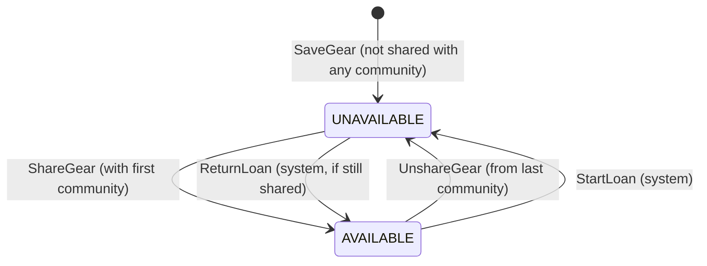
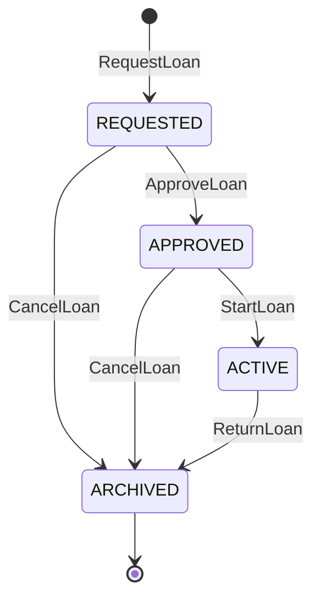

# Ripls Models

This directory contains the storage/persistence model types for the Ripls system.

See [`docs/proto_conventions.md`](../../../docs/proto_conventions.md) for the conventions that govern `ripls.models` and its relationship to `ripls.api` — API message shape, what belongs (and doesn't belong) in the API, and round-trip test expectations.

## Location

Location is an abstraction for physical locations. Users can have one or more Locations associated with themselves and can identify a location as their primary residence. A user's gear will be associated by default with their primary residence as its location. Location is stored in its own table to allow for joins with Users and Gear.

Location is stored as a combination of geodetic (latitude/longitude) location as well as human-readable location, modeled loosely on https://github.com/googleapis/googleapis/blob/master/google/type/postal_address.proto

## State Machines

Gear loaning is implemented as state machines on the `Gear` and `Loan` types. Both state machines are fully implemented with RPC handlers in the service layer.

### Gear Availability State Machine

Gear has two states that track whether it's available for borrowing:

- **UNAVAILABLE**: Gear is not available for borrowing (not shared with any communities, or on loan)
- **AVAILABLE**: Gear is available for borrowing (shared with one or more communities, and not on loan)

#### State Diagram

#### Business Rules

- Gear is created in UNAVAILABLE state and must be explicitly shared with communities (via ShareGear)
- Gear is AVAILABLE if and only if it is shared with at least one community AND not currently on loan
- Gear is UNAVAILABLE if it is not shared with any communities OR is currently on loan
- Only the owner can share or unshare their gear with communities
- System automatically marks gear UNAVAILABLE when a loan transitions to ACTIVE
- System automatically marks gear AVAILABLE when a loan is returned (transitions to ARCHIVED from ACTIVE), provided the gear is still shared with at least one community
- Gear cannot be requested for loan when UNAVAILABLE

### Loan State Machine

A loan tracks the lifecycle of borrowing gear from a lender to a borrower.

#### States

- **REQUESTED**: Borrower has requested to borrow the gear
- **APPROVED**: Lender has approved the request
- **ACTIVE**: Gear is currently loaned out
- **ARCHIVED**: Loan is complete (returned or cancelled)

#### State Diagram

#### Business Rules

- Loan starts in REQUESTED state when created by borrower
- Only the lender can approve a REQUESTED loan
- Either party can cancel a loan before it becomes ACTIVE
- Starting a loan (APPROVED → ACTIVE) triggers gear state change to UNAVAILABLE
- Returning gear (ACTIVE → ARCHIVED) triggers gear state change to AVAILABLE
- Once ARCHIVED, a loan cannot transition to any other state
- LoanActivity records track all state transitions with timestamps and actors

### Integration Between State Machines

The Gear and Loan state machines are coupled at key transition points:

1. **Loan Start (APPROVED → ACTIVE)**:

   - Loan transitions to ACTIVE
   - Associated Gear automatically transitions to UNAVAILABLE
   - Prevents the gear from being requested by other borrowers

2. **Loan Return (ACTIVE → ARCHIVED)**:

   - Loan transitions to ARCHIVED
   - Associated Gear automatically transitions to AVAILABLE (if still shared with at least one community)
   - Makes the gear available for new loan requests (if shared with communities)

3. **Loan Cancellation (REQUESTED/APPROVED → ARCHIVED)**:
   - Loan transitions to ARCHIVED
   - Gear state remains unchanged (should already be AVAILABLE if shared with communities)

## Implementation

The state machines are fully implemented with:

- **RPC Services**: `GearService`, `CommunityService`, and `LoanService` handlers implement all state transitions
- **Storage**: `Gear`, `Community`, `CommunityGear`, `Loan`, `GearActivity`, and `LoanActivity` tables
- **Validation**: Authorization checks, state transition validation, and business rule enforcement
- **Audit Trail**: All state transitions recorded in activity tables with timestamps and actors
- **Explicit Sharing**: Gear must be explicitly shared with communities using `CommunityService.ShareGear` (no automatic sharing on creation)
- **Integration Tests**: Full end-to-end tests for complete loan lifecycle and community sharing

See [services/gear/service.go](../../../server/services/gear/service.go), [services/community/service.go](../../../server/services/community/service.go), and [services/loan/service.go](../../../server/services/loan/service.go) for implementation details.
